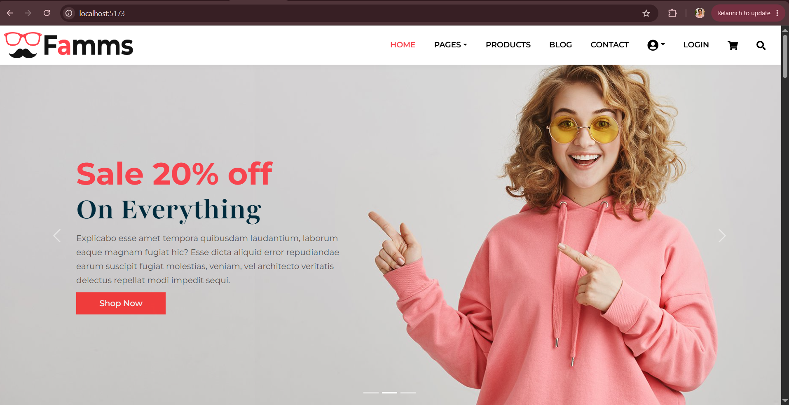
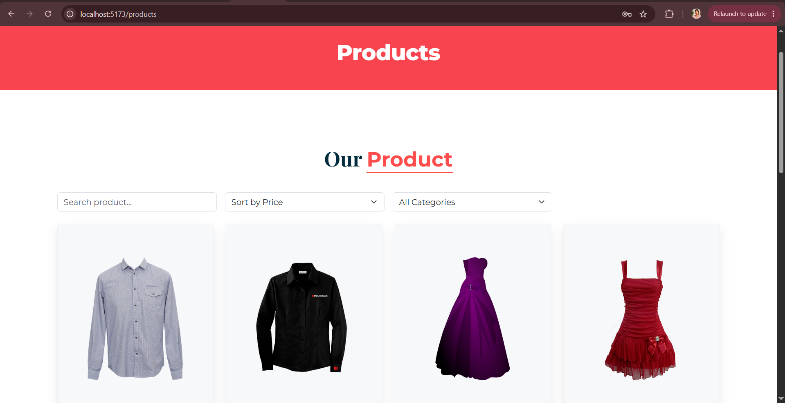
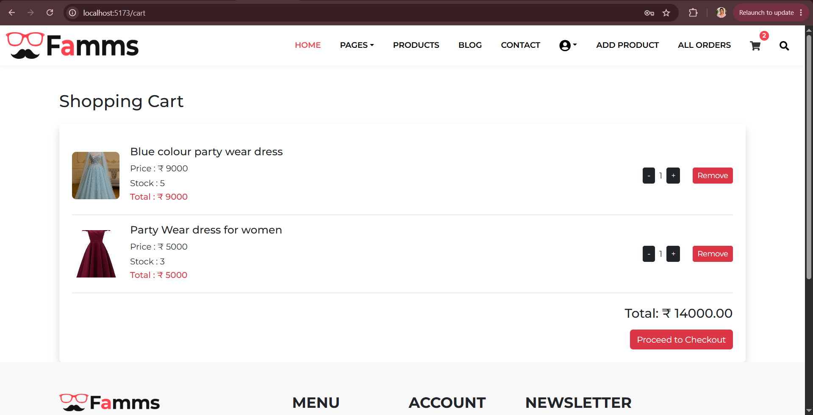
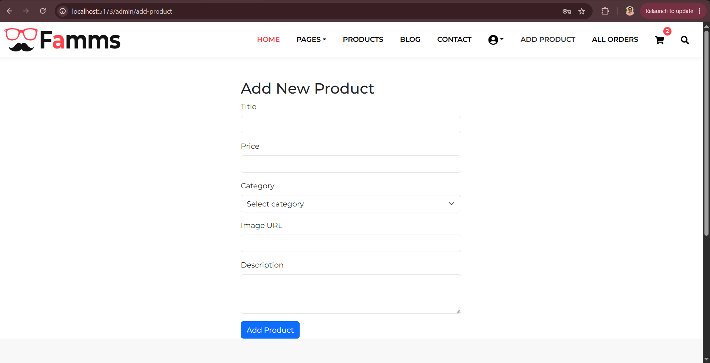
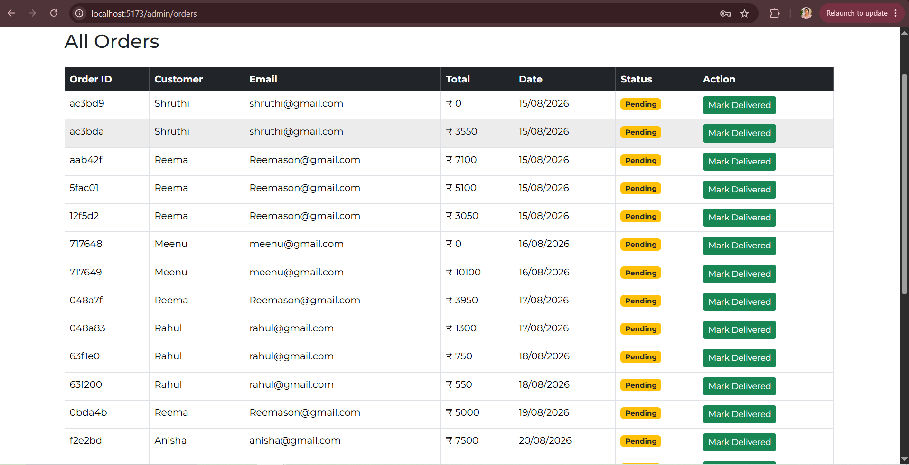
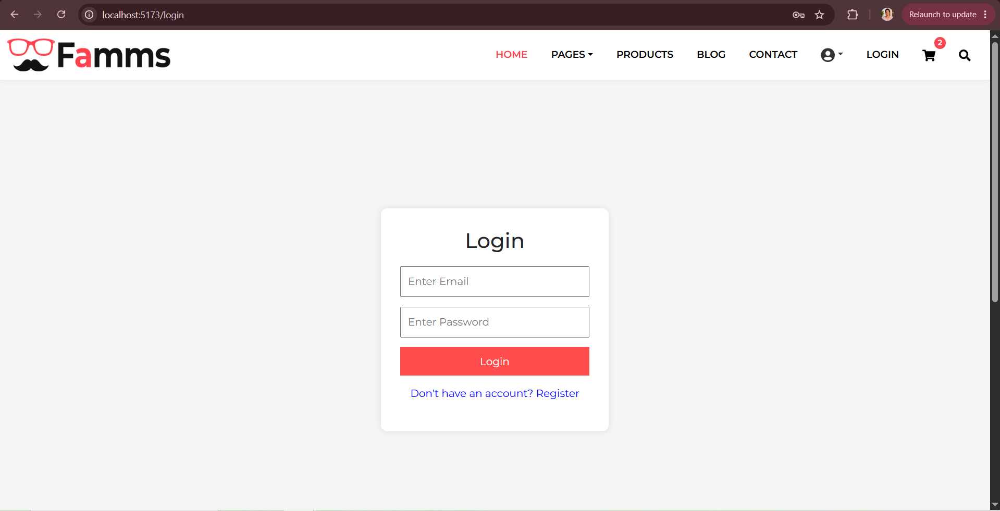

# 🛍️ Famms App

A full-stack E-Commerce web application built using the **MERN Stack** (MongoDB, Express.js, React.js, Node.js). The application allows users to browse products, manage their shopping cart, place orders, and provides an Admin Panel to manage products, users, and orders.

[](#) [](#) [](#)

---

## 📸 Project Screenshot

## 📸 Home Page



---

## 📸 Products



---

## 📸 Shopping Cart



---

## 📸 Admin Dashboard



---

## 📸 Order List 



---

## 📸 Login Page



## 🚀 Live Demo

Frontend: *Coming Soon*

Backend: *Coming Soon*

---

# ✨ Key Features

## 👤 User Features

- User Registration & Login
- JWT Authentication
- Browse Products
- Product Details Page
- Search Products
- Filter Products
- Sort Products
- Add to Cart
- Update Cart Quantity
- Remove Products from Cart
- Wishlist
- Checkout Page
- Place Orders
- View Order History
- Responsive Design (Desktop, Tablet & Mobile)

---

## 👨‍💼 Admin Features

- Secure Admin Login
- Admin Dashboard
- Add Product
- Edit Product
- Delete Product
- View All Products
- View All Orders
- Manage Users
- Protected Admin Routes

---

# 🛠 Tech Stack

## Frontend

- React.js
- Vite
- React Router DOM
- Redux
- React Bootstrap
- CSS3
- JavaScript (ES6)

## Backend

- Node.js
- Express.js
- MongoDB
- Mongoose
- JWT Authentication
- bcryptjs

## Tools

- Git
- GitHub
- Postman
- VS Code

---

# 📂 Project Structure

```
Famms-App/
│
├── src/
│   ├── famms-front-end/
│   │   ├── admin/
│   │   ├── add-on/
│   │   ├── cart-items/
│   │   ├── components/
│   │   ├── home/
│   │   ├── pages/
│   │   ├── products/
│   │   ├── profile/
│   │   ├── redux/
│   │   ├── search/
│   │   └── wishlist/
│   │
│   └── famms-back-end/
│       └── server/
│           ├── config/
│           ├── controllers/
│           ├── middleware/
│           ├── models/
│           ├── routes/
│           ├── data/
│           └── seeder.js
│
├── public/
├── package.json
└── README.md
```

---

# ⚙ Installation

## Clone the Repository

```bash
git clone https://github.com/shruthi06071995/Famms-App.git
```

Go into the project folder

```bash
cd Famms-App
```

---

## Install Dependencies

```bash
npm install
```

---

## Environment Variables

Create a `.env` file inside the backend folder.

```env
PORT=5000

MONGO_URI=your_mongodb_connection_string

JWT_SECRET=your_secret_key
```

---

## Run Backend

```bash
npm run server
```

Runs on

```
http://localhost:5000
```

---

## Run Frontend

Open another terminal

```bash
npm run dev
```

Runs on

```
http://localhost:5173
```

---

# 📌 API Endpoints

## Products

```
GET     /api/products
GET     /api/products/:id
POST    /api/products
PUT     /api/products/:id
DELETE  /api/products/:id
```

---

## Users

```
POST    /api/users/register
POST    /api/users/login
GET     /api/users/profile
```

---

## Orders

```
POST    /api/orders
GET     /api/orders
GET     /api/orders/myorders
```

---

# 📷 Screenshots

You can add screenshots like:

- Home Page
- Products Page
- Product Details
- Shopping Cart
- Login
- Register
- Admin Dashboard
- Add Product
- Edit Product
- Orders Page

---

# 🔮 Future Improvements

- Online Payment Integration
- Product Reviews & Ratings
- Email Notifications
- Image Upload
- Coupon System
- Dashboard Analytics
- Deployment

---

# 👩 Author

**Shruthi**

GitHub:
https://github.com/shruthi06071995

LinkedIn:
(https://www.linkedin.com/in/shruthi-m-07573212b)

---

# ⭐ If you like this project

Please consider giving it a ⭐ on GitHub.